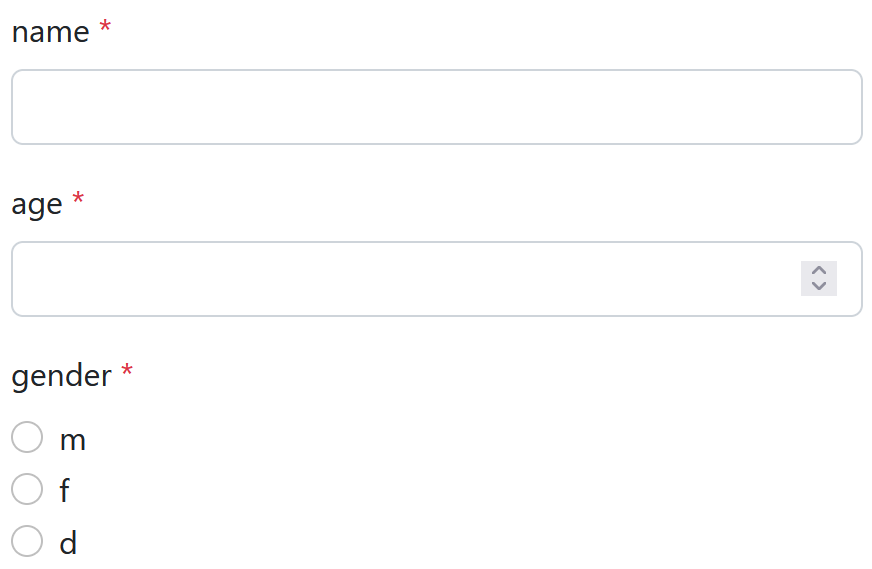

# Forms

## Setup

1. `npm install class-validator`
2. Import the `FormsModule`, e.g. in `AppModule`. 

## Usage

Define a modal class using `class-validator` annotations, for example:

```ts
class Person {
  @IsString()
  @IsNotEmpty()
  @MaxLength(100)
  name!: string;

  @IsInt()
  @Min(0)
  @Max(100)
  age!: number;

  @IsEnum(Gender)
  gender!: Gender;
}
enum Gender { MALE = 'm', FEMALE = 'f', DIVERSE = 'd' }
```

Add the fields to your component:

```ts
export class MyComponent {
  Person = Person; // to make the class available in the template
  person = new Person(); // the model
}
```

Use the `ngbx-validator-form`:

```angular2html
<ngbx-validator-form [type]="Person" [model]="person"></ngbx-validator-form>
```

The final result should look like this:



Validator Forms support many different decorators for various types of inputs.
It is possible to use custom presentation, like textarea, select, placeholder text, etc. using the `@Presentation` decorator.
For a bigger example, see [Forms](/apps/example-web/src/app/forms).
